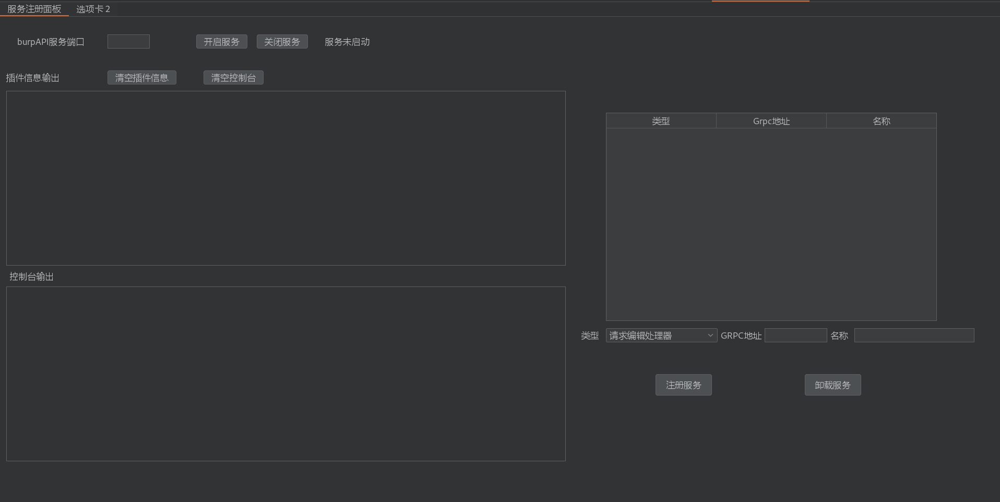
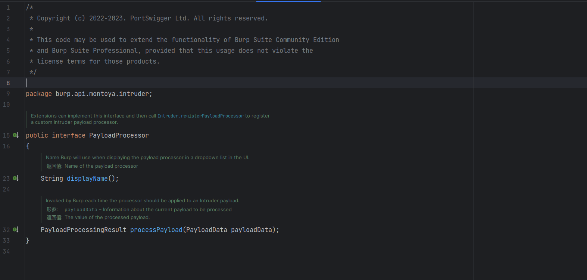
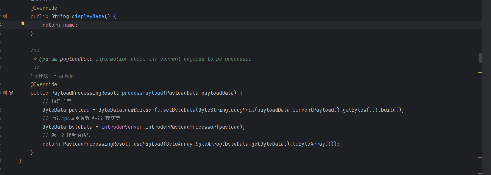
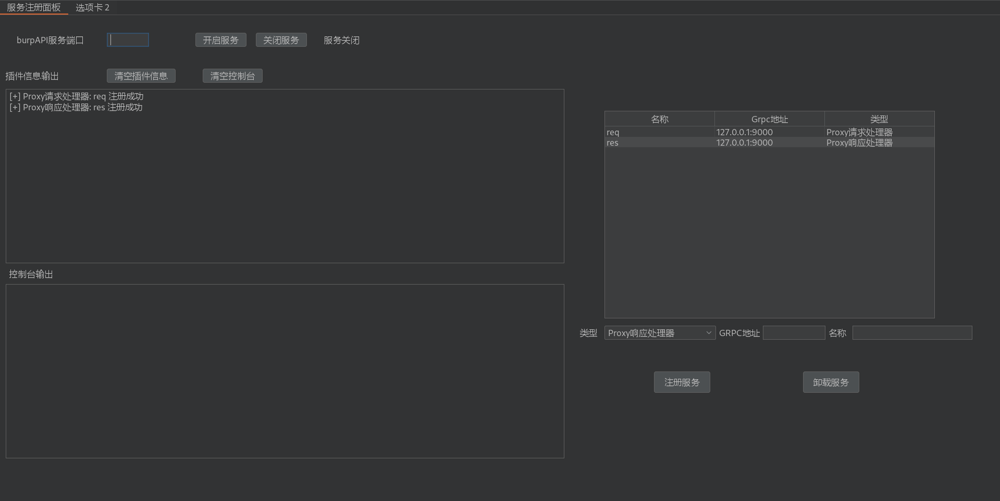
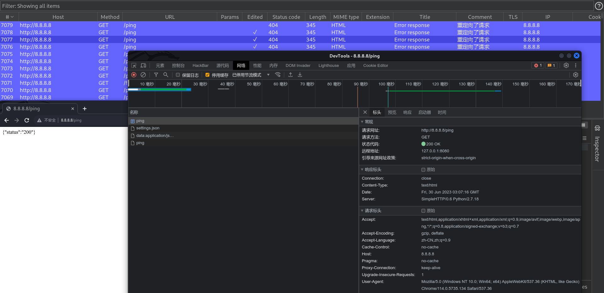
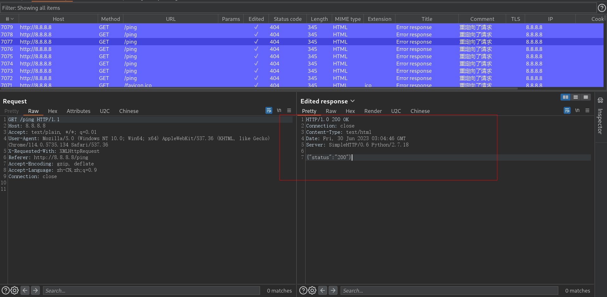
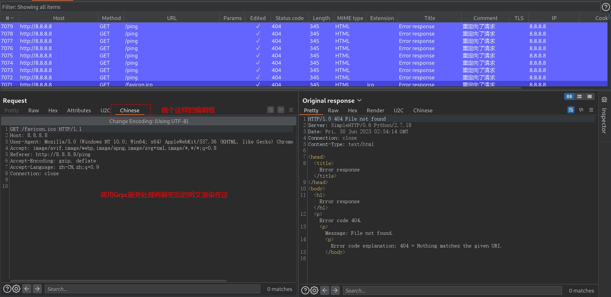

# MorePossibility

MorePossibility (更多可能性) 通过Grpc实现Burp跨语言拓展 , 达到使用python、go、php等Grpc支持的语言进行快速扩展


### 起源

```
早期在面对流量加密想要使用迭代器处理时往往是先对载荷进行处理之后在放到列表中进行迭代处理
之后便使用burpy和其他用于跨语言联动burp的插件但是体验都不好，而且只支持python

有时我们需要对流量进行处理比如想要丢弃某个请求,但是由于不熟悉burpAPI的开发规范只能用手动拦截的方式丢弃
在面对流量加密时,即便已经获取到的加解密算法但是由于不能在burp渲染更直观的操作而加大的系统评估的难度
有时想要将所有burp流量提取并推送到elasticsearch建立索引,苦于java限制而不能实现,想要实现就要编写java代码

有时工具和框架并不是一个好东西，因为他在向你提供功能的同时也束缚住了你，让你局限在他的规则和功能之下

因此我们设计并开发了MorePossibility 译文是 更多可能性 我们不提供任何实质性功能，只是提供一道桥梁，让渗透测试者在面对问题时可以有更多可用手段,有更多的想象空间和可能性
```


插件截图




### 快速了解

#### 先前条件

该插件实现跨语言拓展靠的是Grpc , 我们将BurpAPI中的函数做成了Grpc接口函数

该拓展建立在Grpc之上如果你此前对Grpc一无所知 , 你需要先了解Grpc

不需要太深只要看懂hello world 就行    

官网: https://grpc.io/     (选择自己擅长的语言)

哔哩哔哩狂神 https://www.bilibili.com/video/BV1S24y1U7Xp    (视频讲解推荐)


#### 演示Demo

https://github.com/kaliwin/go-Demo-MorePossibility       go 演示 包含所有API


### 工作逻辑


以迭代处理器为例

在burp中插件要实现迭代处理需要实现一个接口 PayloadProcessor 

两个函数一个获取名称 一个用于迭代处理 入参和回参 其实都是 字节数组 []byte



我们在插件中实现了这个函数  可以看到 通过Grpc进行远程函数调用 再将结果返回  实际逻辑在你Grpc服务器实现





就是将插件真正的实际处理通过Grpc调用让外部处理 之后在通过响应的结果完成相应的动作 这就是我们跨语言拓展的核心


### 场景演示

burp是WEB渗透工具 说到底就是对web流量分析和处理 


#### 无中生响应

假设你有一个APP或者Web的H5页面, 他有一个功能是要向内网发送一个心跳包而你不在他的内网就不会有心跳包回显那他的功能也就不能继续了


这个时候你是不是想修改js或者app hook 修改逻辑 这样似乎会更复杂 你可以通过编写Burp插件 将请求重定向到一个可以访问的页面中在修改响应来确保他的心跳包正常回显

要实现这个功能你需要编写java代码 注册两个服务一个代理请求处理器和代理响应处理器 然后将内网的url重定向到可以访问的地址在修改他的响应

这样你需要写大量的代码 , 如果时间比较紧 或者后续还有其他流量处理的需求就会显得很仓促 这就是MorePossibility存在的意义 下面演示如何解决该问题


你可以使用任何Grpc支持的语言完成拓展 这里用 go 

目标是    http://8.8.8.8/ping     我们要他返回 状态码200 响应体是  {"status":"200"}

代码逻辑是

注册代理请求处理器, burp中的所有代理请求都会回调这个函数入参就是请求的对象信息你处理后返回你的要的动作就行这里要修改请求就是IsReviseReq: true 在给修改后的请求对象就行

注册代理响应处理器，burp中所有 有响应的包都会回调这个函数 (如果连接失败就不会调用 , 这就是为什么我们要先修改请求地址到一个可以访问的地址) , 之后判断是不是我们想要改的响应 修改状态码 和响应体之后返回 整个代码就这点东西


引入的都是官方的标准库和Grpc的库  你只要看懂Grpc的hello world  你就知道这样有多简单了

```go
package main

import (
	"bufio"
	"bytes"
	"context"
	"fmt"
	"go-Demo-MorePossibility/MorePossibility/proto/BurpApi"
	"google.golang.org/grpc"
	"io"
	"net"
	"net/http"
	"strings"
)

type Demo struct {
	BurpApi.UnimplementedProxyRequestHandlerServer   // 代理请求  这是Grpc生成的 
	BurpApi.UnimplementedProxyResponseHandlerServer  // 代理响应
}
// 判断请求地址是不是 8.8.8.8 是就修改地址为127.0.0.1:8089 这样才能有响应
func (Demo) ProxyHandleRequestReceived(c context.Context, hrg *BurpApi.HttpReqGroup) (*BurpApi.ProxyRequestAction, error) {
	if strings.EqualFold(hrg.GetHttpReqData().GetHttpReqService().GetIp(), "8.8.8.8") { // ip是8.8.8.8就会进入
		hrg.HttpReqData.HttpReqService.Ip = "127.0.0.1" // 修改目标ip
		hrg.HttpReqData.HttpReqService.Port = 8089      //  端口
		hrg.HttpReqData.HttpReqService.Secure = false   // 是否使用TLS
		return &BurpApi.ProxyRequestAction{
			Continue:    false,
			Drop:        false,
			IsReviseReq: true, // 修改请求
			IsIntercept: false,
			HttpReqGroup: &BurpApi.HttpReqGroup{
				HttpReqData: hrg.HttpReqData,
				AnnotationsText: &BurpApi.AnnotationsText{
					IsInfo: true,
					Notes:  "重定向了请求",
					Color:  BurpApi.HighlightColor_BLUE, // 颜色
				},
			},
		}, nil
	}
	return &BurpApi.ProxyRequestAction{Continue: true}, nil // 不是8.8.8.8 的继续不做处理
}
// 判断请求的是不是127.0.0.1 因为之前请求已经改过了 
func (Demo) ProxyHandleResponseReceived(c context.Context, httpReqAndRes *BurpApi.HttpReqAndRes) (*BurpApi.ProxyResponseAction, error) {
	if strings.EqualFold(httpReqAndRes.GetReq().GetHttpReqService().GetIp(), "127.0.0.1") { // 是否是我们重定向的请求
		res := httpReqAndRes.GetRes() // 获取响应
		resData := res.GetData()    // 响应字节流

		response, err := http.ReadResponse(bufio.NewReader(bytes.NewReader(resData)), nil) // 将字节流解析为响应对象
		if err != nil {
			return &BurpApi.ProxyResponseAction{Continue: true}, nil
		}

		response.Body = io.NopCloser(bytes.NewReader([]byte("{\"status\":\"200\"}"))) // 修改响应
		response.StatusCode = 200  // 修改状态码
		response.Status = "OK"

		var buffer bytes.Buffer

		_ = response.Write(&buffer)  // 将响应对象读回字节流

		return &BurpApi.ProxyResponseAction{
			Continue:    false,
			Drop:        false,
			IsReviseRes: true,      // 修改响应
			IsIntercept: false,
			HttpResGroup: &BurpApi.HttpResGroup{
				HttpResData: &BurpApi.HttpResData{
					Data: buffer.Bytes(),     
				},
				AnnotationsText: nil,
			},
		}, nil
	}
	return &BurpApi.ProxyResponseAction{Continue: true}, nil
}

func main() {
	listen, err := net.Listen("tcp", ":9000")
	if err != nil {
		panic(err)
	}
	server := grpc.NewServer()
	BurpApi.RegisterProxyRequestHandlerServer(server, Demo{})
	BurpApi.RegisterProxyResponseHandlerServer(server, Demo{})
	fmt.Println("服务启动")
	err = server.Serve(listen)
	if err != nil {
		panic(err)
	}
}

```


注册两个服务 代理请求和请求响应 处理器   之后proxy的所有请求和响应都要调你Grpc的函数




构造出了响应




python 开了个http服务 然后修改响应





我们还有别的Demo演示 都在 https://github.com/kaliwin/go-Demo-MorePossibility  

### 未来展望

#### 1、云 协助渗透

​	你可以看到burp的API都是通过Grpc连接的, 也就是说你可以将你的服务放到服务器上比如你要通过正则像HaE那样匹配敏感信息 ，你就可以用实时流量镜像功能将你的流量传给服务器 ，服务器通过一堆正则匹配再将结果返回  可缓解本机计算压力 这样还可以多人使用 团队里的多个人可将流量传给服务器一并处理

有了流量你就可以分析其中的道道 可以调用工具测试载荷   


#### 2、团队协作 多人运动

​	假设目标站点请求体使用了加密 ，你们团队中有人知道了解密方式直接注册MorePossibility中的请求编辑器将Grpc服务放在服务器上这样其他人就不必关心具体实现点击注册填写服务器地址即可 




#### 3、一键目录枚举

实现上下文菜单项  可以选中这个目录右键一键扫描目录 


#### 4、流量标识


​	该功能目前没有可用实现方法但是很快的

可以看到代理历史记录或者Logger 那会有部分请求有注解有颜色 用于高亮标识特殊的流量 

我们想把他放在一个页面里 实现共享 比如你对这个数据包有疑问可以打上标识和颜色写上备注 发送到一个页面中 这样团队中的其他人也可以看到并可放到重放包进行测试加强团队协作


#### 5、实时流量镜像


在所有功能中实时流量镜像是最重要最强大的 这也是我们开发MorePossibility初心之一 

他将为史诗庇护所提供数据来源     

大致逻辑就是将所有burp中的流量发送给史诗庇护所然后建立elasticsearch索引 这样你就可以更好的分析流量了场景如下

1、靶场流量记录 将所有你靶场中的流量记录下来比如新披露的漏洞你测试到的漏洞，这样数据量大了你就可以分析各个类型漏洞的特征比如任意文件读取你可以用elasticsearch搜索字段调用所有任意文件读取的包分析他们的特征, 也可以调用某个组件比如Spring相关的漏洞分析各个版本的差异, 又或者调用你的笔记

万物皆可被索引 有了索引时间越久数据越多你就会越快乐

2、常规流量记录 

​	SRC 举例前期信息收集会有很多域名服务 你可以建立索引将 xx.com 相关的数据和流量记录

因为信息有时是环环相扣的建立了索引 比如有个后台 下面有 技术管理员张XX 联系方式：1388888888

有了海量数据 你就可以直接搜索1388888888 看有多少个系统是他负责的		 (爬虫 刺探公民信息不合法  这里只在入侵角度举例可行性)


史诗庇护所是ManDown(友军倒下) 中的一环   我们正在构建一套全新的渗透测试框架 我们希望能向安全人员提供实际功能和桥梁 最重要的就是桥梁 ManDown将允许你自由的DIY 不在局限于任何工具和环境  最重要的不是你能做什么 而是你想做什么 你想要达成什么目标 你想要去往何处


### 最后

好了MorePossibility 的故事讲完了 正如上面说的这只是ManDown的开始 如果你对该项目有任何疑问或有其他见解又或者你想要了解ManDown的更多细节或想加入其中的可以向我们投递邮箱 ggicyvk@163.com 你需要说明来意 不必担心文本过多或语法不通因为我们会看完的


最后 如果我们选择的道路相同 ，破晓时分我们就会再见面


